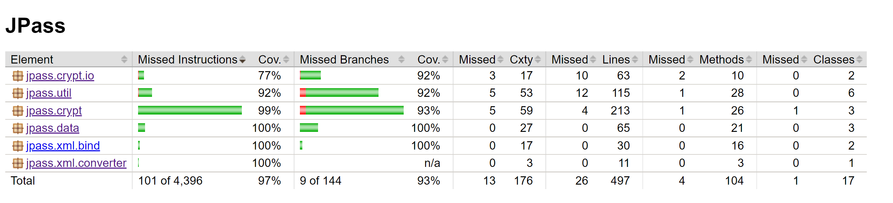

# Structural Testing
 
## Initial Coverage

By making use of the JaCoCo library, the following test coverage report was created, which concerns the tests that were already present in the project, in addition to the work developed in the previous assignments.

The package `jpass.crypt`, the one which out-of-the-box already had some tests created for it, is by far the one with the highest (line and branch) coverage.

## Features explored

The most used notation was `@Test` which describes a normal JUnit test.
When deemed useful, the `@BeforeEach` notation was utilized, serving the respective methods as setup functions, initializing a base state over which every test of that group will operate over. `@BeforeAll` is also utilized to avoid trying to initialize more than once an object that is treated as a singleton in its class. There was also a situation were `@Nested` (and `@DisplayName`) was considered helpful as allowed to compartmentalize some tests which required extra setup steps  from the rest of the test suite of that class.
When it came to the tests themselves, `@ParameterizedTest` and consequently `@ValueSource` were JUnit annotations that are present in the presented test suite, avoiding unnecessary code repetition for almost identical tests where the input was the only difference.
Furthermore, and although not JUnit-related, worthy of mention are: `@Override` in auxiliary methods to help with testing the clipboard, and the use of the Java mocking library Mockito.
Finally, in cases where state clean up was needed in order not to interfere with other tests, JUnit's `@AfterEach` was applied.

## Final Coverage

As instructed in the assignment specification, the GUI-related classes were ignored for this coverage testing (package `jpass.ui`, and classes `jpass.util.SpringUtilities.class` and `jpass.JPass.class`), resulting in the following line and branch coverage:

Note: to obtain both reports, `mvn test` was executed, being the screenshots provided from the generated html.