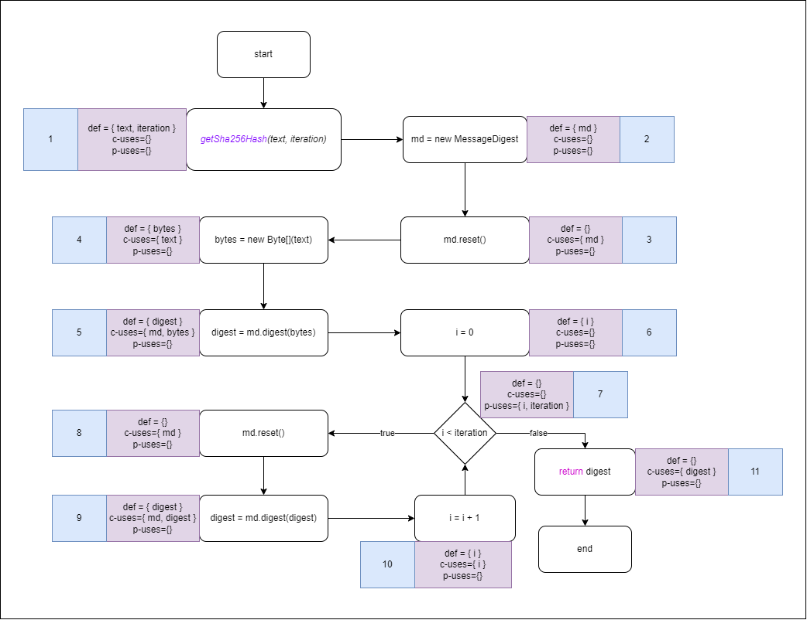

## jpass.util.CryptUtils.getSha256Hash

### Variable `text`
| **var** | **id** | **def** | **use** | **path**  |
| :-----: | :----: | :-----: | :-----: |:---------:|
|  text   |   1    |    1    |    4    | <1,2,3,4> |

- **all-defs**
  - The path with `id=1` covers all the criteria needed
- **all-c-uses**
  - The path with `id=1` covers all the criteria needed
- **all-p-uses**
  - Variable `text` doesn't have any p-use, therefore, there's no need to cover this criteria
- **all-uses**
  - The path with `id=1` covers all the criteria needed

### Variable `iteration`
|  **var**  | **id** | **def** | **use** |      **path**      |
| :-------: | :----: | :-----: | :-----: |:------------------:|
| iteration |   1    |    1    |    7    | <1,2,3,4, 5, 6, 7> |

- **all-defs**
  - The path with `id=1` covers all the criteria needed
- **all-c-uses**
  - Variable `iteration` doesn't have any c-use, therefore, there's no need to cover this criteria
- **all-p-uses**
  - The path with `id=1` covers all the criteria needed
- **all-uses**
  - The path with `id=1` covers all the criteria needed

### Variable `md`
| **var** | **id** | **def** | **use** |     **path**      |
| :-----: | :----: | :-----: | :-----: |:-----------------:|
|   md    |   1    |    2    |    3    |       <2,3>       |
|   md    |   2    |    2    |    5    |     <2,3,4,5>     |
|   md    |   3    |    2    |    8    |  <2,3,4,5,6,7,8>  |
|   md    |   4    |    2    |    9    | <2,3,4,5,6,7,8,9> |

- **all-defs**
  - The path with `id=4` covers all the criteria needed, as the other paths are redundant
- **all-c-uses**
  - To cover this testing criteria, all paths are needed
- **all-p-uses**
  - Variable `md` doesn't have any p-uses, therefore, there's no need to cover this criteria
- **all-uses**
  - To cover this testing criteria, all paths are needed

### Variable `bytes`
| **var** | **id** | **def** | **use** | **path**  |
| :-----: | :----: | :-----: | :-----: | :-------: |
|  bytes  |   1    |    4    |    5    | **<4,5>** |

- **all-defs**
  - The path with `id=1` covers all the criteria needed
- **all-c-uses**
  - The path with `id=1` covers all the criteria needed
- **all-p-uses**
  - Variable `bytes` doesn't have any p-use, therefore, there's no need to cover this criteria
- **all-uses**
  - The path with `id=1` covers all the criteria needed

### Variable `digest`
| **var** | **id** | **def** | **use** |  **path**   |
| :-----: | :----: | :-----: | :-----: |:-----------:|
| digest  |   1    |    5    |   11    | <5,6,7,11>  |
| digest  |   2    |    5    |    9    | <5,6,7,8,9> |
| digest  |   3    |    9    |    9    |    <9,9>    |
| digest  |   4    |    9    |   11    | <9,10,7,11> |

- **all-defs**
  - The paths with `id=1` and `id=4` are enough to satisfy this testing criteria, with other paths being redundant
- **all-c-uses**
  - To satisfy this testing criteria, all paths are necessary
- **all-p-uses**
  - The variable `digest` doesn't have any p-uses, therefore, there's no need to cover this criteria
- **all-uses**
  - To satisfy this testing criteria, all paths are necessary

### Variable `i`
| **var** | **id** | **def** | **use** |   **path**   |
| :-----: |:------:| :-----: | :-----: |:------------:|
|    i    |   1    |    6    |    7    |    <6,7>     |
|    i    |   2    |    6    |   10    | <6,7,8,9,10> |
|    i    |   3    |   10    |   10    |   <10,10>    |
|    i    |   4    |   10    |    7    |    <10,7>    |

- **all-defs**
  - The paths with `id=2` and `id=4` are enough to satisfy this testing criteria, with other paths being redundant
- **all-c-uses**
  - To satisfy this testing criteria, path with `id=2` and `id=3` are necessary, other paths are p-uses
- **all-p-uses**
  - To satisfy this testing criteria, path with `id=1` and `id=4` are necessary, other paths are c-uses
- **all-uses**
  - To satisfy this testing criteria, all paths are necessary