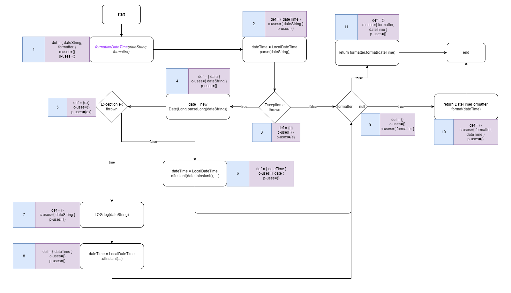

## jpass.util.CryptUtils.getSha256Hash

### Variable `text`
| **var** | **id** | **def** | **use** | **path**  |
| :-----: | :----: | :-----: | :-----: | :-------: |
|  text   |   1    |    1    |    4    | <1,2,3,4> |

- **all-defs**
  - The path with `id=1` covers all the criteria needed
- **all-c-uses**
  - The path with `id=1` covers all the criteria needed
- **all-p-uses**
  - Variable `text` doesn't have any p-use, therefore, there's no need to cover this criteria
- **all-uses**
  - The path with `id=1` covers all the criteria needed

### Variable `iteration`
|  **var**  | **id** | **def** | **use** |      **path**      |
| :-------: | :----: | :-----: | :-----: | :----------------: |
| iteration |   1    |    1    |  (7,F)  | <1,2,3,4,5,6,7,11> |
| iteration |   2    |    1    |  (7,T)  | <1,2,3,4,5,6,7,8>  |

- **all-defs**
  - The path with `id=1` covers all the criteria needed
- **all-c-uses**
  - Variable `iteration` doesn't have any c-use, therefore, there's no need to cover this criteria
- **all-p-uses**
  - To satisfy this testing criteria, all paths are necessary
- **all-uses**
  - To satisfy this testing criteria, all paths are necessary

### Variable `md`
| **var** | **id** | **def** | **use** |     **path**      |
| :-----: | :----: | :-----: | :-----: | :---------------: |
|   md    |   1    |    2    |    3    |       <2,3>       |
|   md    |   2    |    2    |    5    |     <2,3,4,5>     |
|   md    |   3    |    2    |    8    |  <2,3,4,5,6,7,8>  |
|   md    |   4    |    2    |    9    | <2,3,4,5,6,7,8,9> |

- **all-defs**
  - The path with `id=4` covers all the criteria needed, as the other paths are redundant
- **all-c-uses**
  - To cover this testing criteria, all paths are needed
- **all-p-uses**
  - Variable `md` doesn't have any p-uses, therefore, there's no need to cover this criteria
- **all-uses**
  - To cover this testing criteria, all paths are needed

### Variable `bytes`
| **var** | **id** | **def** | **use** | **path** |
| :-----: | :----: | :-----: | :-----: | :------: |
|  bytes  |   1    |    4    |    5    |  <4,5>   |

- **all-defs**
  - The path with `id=1` covers all the criteria needed
- **all-c-uses**
  - The path with `id=1` covers all the criteria needed
- **all-p-uses**
  - Variable `bytes` doesn't have any p-use, therefore, there's no need to cover this criteria
- **all-uses**
  - The path with `id=1` covers all the criteria needed

### Variable `digest`
| **var** | **id** | **def** | **use** |   **path**   |
| :-----: | :----: | :-----: | :-----: | :----------: |
| digest  |   1    |    5    |   11    |  <5,6,7,11>  |
| digest  |   2    |    5    |    9    | <5,6,7,8,9>  |
| digest  |   3    |    9    |    9    | <9,10,7,8,9> |
| digest  |   4    |    9    |   11    | <9,10,7,11>  |

- **all-defs**
  - The paths with `id=1` and `id=4` are enough to satisfy this testing criteria, with other paths being redundant
- **all-c-uses**
  - To satisfy this testing criteria, all paths are necessary
- **all-p-uses**
  - The variable `digest` doesn't have any p-uses, therefore, there's no need to cover this criteria
- **all-uses**
  - To satisfy this testing criteria, all paths are necessary

### Variable `i`
| **var** | **id** | **def** | **use** |   **path**    |
| :-----: | :----: | :-----: | :-----: | :-----------: |
|    i    |   1    |    6    |  (7,F)  |   <6,7,11>    |
|    i    |   2    |    6    |  (7,T)  |    <6,7,8>    |
|    i    |   3    |    6    |   10    | <6,7,8,9,10>  |
|    i    |   4    |   10    |   10    | <10,7,8,9,10> |
|    i    |   5    |   10    |  (7,F)  |   <10,7,11>   |
|    i    |   6    |   10    |  (7,T)  |   <10,7,8>    |

- **all-defs**
  - The paths with `id=2` and `id=4` are enough to satisfy this testing criteria, with other paths being redundant
- **all-c-uses**
  - To satisfy this testing criteria, path with `id=3` and `id=4` are necessary, other paths are p-uses
- **all-p-uses**
  - To satisfy this testing criteria, path with `id=1`, `id=2`, `id=5` and `id=6` are necessary, other paths are c-uses
- **all-uses**
  - To satisfy this testing criteria, all paths are necessary

### Implemented Tests
This function is private, however, it can be tested via two public functions:
- `getSha256Hash` - overload that calculates the hash at `iteration=0`
- `getPKCS5Sha256Hash` - calculates the hash at `iteration=1000`

The tests already developed for the two functions above already cover all paths needed to be tested.
- Testing the function `getSha256Hash` tests the following paths for each variable:
  - `text` - All paths
  - `iteration` - Path with `id=1`
  - `md` - Covers the path `id=1` and `id=2` but these are redundant with the tests on the other function
  - `bytes` - All paths
  - `digest` - Covers path with `id=1`
  - `i` - Covers path with `id=1`
- Testing the function `getPKCS5Sha256Hash` tests the following paths for each variable:
  - `text` - All paths
  - `iteration` - Path with `id=2`
  - `md` - Covers the path `id=3` (redundant) and `id=4`
  - `bytes` - All paths
  - `digest` - All paths except path with `id=1`
  - `i` - All paths except path with `id=1`

## jpass.util.StringUtils.stripString

### Variable `text`
| **var** | **id** | **def** | **use** | **path**  |
|:-------:|:------:|:-------:|:-------:|:---------:|
|  text   |   1    |    1    |    2    |   <1,2>   |
|  text   |   2    |    1    |    4    | <1,2,3,4> |
|  text   |   3    |    1    |  (3,T)  | <1,2,3,4> |
|  text   |   4    |    1    |  (3,F)  | <1,2,3,5> |

### Variable `length`

| **var** | **id** | **def** | **use** | **path**  |
|:-------:|:------:|:-------:|:-------:|:---------:|
| length  |   1    |    1    |    4    | <1,2,3,4> |
| length  |   2    |    1    |  (3,T)  | <1,2,3,4> |
| length  |   3    |    1    |  (3,F)  | <1,2,3,5> |

### Variable `result`

| **var** | **id** | **def** | **use** | **path** |
|:-------:|:------:|:-------:|:-------:|:--------:|
| result  |   1    |    2    |    5    | <2,3,5>  |
| result  |   2    |    4    |    5    |  <4,5>   |

--

***DÚVIDAS:***

***1. como fazer na tabela condições (T e F) uma vez que o if junta as 2 variaveis?***

***2. not sure nos all-uses :/***

--

- **All-defs**
  - All-defs coverage is achieved as there is at least one def-clear path from every definition of `text`, `length`, and `result` to at least one c-use or p-use of each variable is covered: for example, for `text`, the path of pair id 1, for `length`, the path of pair id 1, and for `result`, the path of pair id 1.

- **All-c-uses**
  - `text`
    - It is only defined once and is c-used twice.
    - Pair ids 1 and 2 (one for each of the c-uses) imply the satisfaction of this testing criteria (one def-clear path from every definition to every c-use).
  - `length`
    - It is only defined and c-used once.
    - Pair id 1 implies the satisfaction of this testing criteria (one def-clear path from every definition to every c-use).
  - `result`
    - It is defined twice and c-used once.
    - Pair ids 1 and 2 (one for each of the definitions) imply the satisfaction of this testing criteria (one def-clear path from every definition to every c-use).

- **All-p-uses**
  - `text`
    - It is only defined once and is p-used twice.
    - Pair id 3 (or 4) imply the satisfaction of this testing criteria (one def-clear path from every definition to every p-use).
  - `length`
    - It is only defined once and is p-used twice. 
    - Pair id 2 (or 3) imply the satisfaction of this testing criteria (one def-clear path from every definition to every p-use).
  - `result`
    - Does not have any p-uses, therefore, there's no need to cover this criteria.

- **All-uses**
  - `text`
    - To satisfy this testing criteria, all paths are necessary.
  - `length`
    - To satisfy this testing criteria, all paths are necessary.
  - `result`
    - To satisfy this testing criteria, all paths are necessary.

<!--
all-def -> for every program variable v, at least one def-clear path from every
definition of v to at least one c-use or one p-use of v must be covered. In
other words, test cases include a def-clear path from every definition of v to
some corresponding use (either c-use or p-use).

def-clear -> in respect to a var v, if it has no variable re-definition of v on the path.
In other words, any path starting from a node at which
variable v is defined and ending at a node at which v is
used, without redefining v anywhere else along the path, is
a def-clear path for v

All-c-uses: for every program variable v, at least
one def-clear path from every definition of v to
every c-use of v must be covered.

All-p-uses: for every program variable v, at
least one def-clear path from every
definition of v to every p-use of v must be
covered.

All-uses: for every program variable v, at least
one def-clear path from every definition of v to
every c-use and every p-use (including all
outgoing edges of the predicate statement) of v
must be covered. Requires that all def-use pairs
are covered.
-->

## jpass.util.DateUtils.formatIsoDateTime

### Variable `dateString`
| **var** | **id** | **def** | **use** |   **path**    |
| :-----: | :----: | :-----: | :-----: | :-----------: |
|    i    |   1    |    1    |  3  |   <6,7,11>    |
|    i    |   1    |    1    |  5  |   <6,7,11>    |
|    i    |   1    |    1    |  9  |   <6,7,11>    |

### Variable `formatter`
| **var** | **id** | **def** | **use** |   **path**    |
| :-----: | :----: | :-----: | :-----: | :-----------: |
|    i    |   1    |    6    |  (7,F)  |   <6,7,11>    |

### Variable `dateTime`
| **var** | **id** | **def** | **use** |   **path**    |
| :-----: | :----: | :-----: | :-----: | :-----------: |
|    i    |   1    |    6    |  (7,F)  |   <6,7,11>    |

### Variable `e`
| **var** | **id** | **def** | **use** |   **path**    |
| :-----: | :----: | :-----: | :-----: | :-----------: |
|    i    |   1    |    6    |  (7,F)  |   <6,7,11>    |

### Variable `date`
| **var** | **id** | **def** | **use** |   **path**    |
| :-----: | :----: | :-----: | :-----: | :-----------: |
|    i    |   1    |    6    |  (7,F)  |   <6,7,11>    |

### Variable `ex`
| **var** | **id** | **def** | **use** |   **path**    |
| :-----: | :----: | :-----: | :-----: | :-----------: |
|    i    |   1    |    6    |  (7,F)  |   <6,7,11>    |
