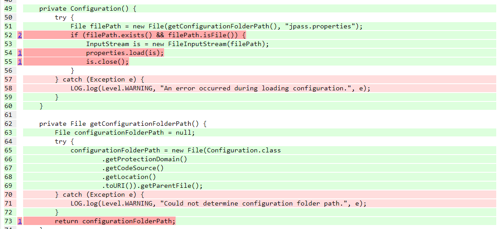

# Mutation Testing

## jpass.util.ClipboardUtils

Despite the tests passing when running `mvn test`, Pitest outputs failures. This lead to the class being ignored from mutation testing.

However, the inner class within `ClipboardUtils`, `EmptyClipboardContent`, had surviving mutants due to no coverage. To fix this, the following tests were implemented:
```diff
+ @Test
+ public void testEmptyClipboardObject() {
+    ClipboardUtils.EmptyClipboardContent emptyClipboardContent = new ClipboardUtils.EmptyClipboardContent();
+
+    DataFlavor dataFlavor = DataFlavor.stringFlavor;
+
+    Assertions.assertFalse(emptyClipboardContent.isDataFlavorSupported(dataFlavor));
+    Assertions.assertArrayEquals(new DataFlavor[] { }, emptyClipboardContent.getTransferDataFlavors());
+    Assertions.assertThrows(UnsupportedFlavorException.class, () -> emptyClipboardContent.getTransferData(dataFlavor));
+ }
```
Due to the simplicity of the code to be tested, just a simple test to cover the lines were enough to kill the mutants.

## jpass.util.Configuration

This class had 4 mutants that survived, however, only two of these was a valid mutant survival. The image below showcases the four mutants that survived not by lack of testing, but rather due to Pitest fault. The mutants are, in order:
1. Negated Conditional on `filePath.exists()`
2. Negated Conditional on `filePath.isFile()`
3. Removed call on `properties.load(is)`
4. replace return with null on `return configurationFolderPath`



The tests developed should cover these mutations, since, for example, by negating the conditional, the properties would not be loaded, and therefore tests checking if the properties are correctly loaded would fail. However, Pitest has an issue when isolating test cases and mutations with Singleton-type classes, like `Configuration`, and falsely reports this mutants due to previous state being kept between tests/mutations.

As a workaround to address this issue, we used Reflections at the setup method of this class to clear the Configuration instance:
```diff
properties.store(outputStream, "Testing Property File");

+ Field instanceField = Configuration.class.getDeclaredField("INSTANCE");
+ instanceField.setAccessible(true);
+ instanceField.set(configuration, null);

configuration = Configuration.getInstance();
```

The remaining two mutants that survived were:

- Remove call on `is.close()`

To address this mutant, we added a test that attempted to delete the file after creating an instance of the Configuration, as we observed the file couldn't be deleted if the input stream wasn't closed. However, the garbage collector should've closed the input stream regardless after the method ended, as it was observed on another situation (see [EntriesRepository](#jpassdataentriesrepository)). So this mutant might be a case of an equivalent mutant.

- Negate conditional on `if (INSTANCE == null)` in method `getInstance`

To address this mutant, we added a test to verify if the singleton is working correctly, since this if checks if the instance already exists, and if so, return the previously created instance.
```java
@Test
public void testConfigurationSingleton() throws IOException {
    Properties properties = new Properties();
    properties.setProperty("test.pass", "notjojo");

    OutputStream outputStream = Files.newOutputStream(filePath.toPath(), new StandardOpenOption[]{TRUNCATE_EXISTING});

    properties.store(outputStream, "Testing Property File");

    Configuration configuration_singleton = Configuration.getInstance();

    Assertions.assertEquals(configuration.get("test.pass", "undefined"), configuration_singleton.get("test.pass", "undefined2"));
}
```

<<<<<<< HEAD
## jpass.crypt.Cbc

A total of 6 mutants survived in this class with the tests developed previously.

1. Two conditional boundary changes on methods `encrypt` and `decrypt`

However, we observed both of these mutants were equivalent mutants, as the behaviour of the function did not change by replacing the condition `length <= 0` with `length < 0`, as the `for` loop would not execute any iteration under length equal to 0, leading to the same result. Code of one of the methods is shown below for demonstration:

```java
public void encrypt(byte[] data, int length) throws IOException {
    if (data == null || length <= 0) {
        return;
    }

    for (int i = 0; i < length; ++i) {
        this._overflow[this._overflowUsed++] = data[i];
        if (this._overflowUsed == BLOCK_SIZE) {
            encryptBlock(this._overflow, this._outBuffer);
            this._output.write(this._outBuffer);
            this._overflowUsed = 0;
        }
    }
}
```

2. Two Conditional boundaries on `if (pad <= 0 || pad > BLOCK_SIZE)` and one on `if (left > 0)` in method `finishDecryption`

Due to the complexity of the algorithm and it involving encryption, we opted to not address these mutants as manipulating the input to kill these mutants is complicated and requires trial and error.

3. Remove call on `this._output.close()` in method `finishDecryption`

Since we can initialize the Cbc with a custom OutputStream, we addressed the mutant by creating a FileOutputStream to output the decryption result. Invoking `close` on a FileOutputStream that is already closed results on an exception, therefore, if the method `finishDecryption` is called twice, it should result on an exception. This way, we can kill the mutant, as removing this call has the consequence of the second call to `finishDecryption` not resulting in exception. The following test was implemented:

```java
@Test
public void testWriteToFileTwice() throws DecryptException, IOException {
    byte[] iv = {(byte) 0x51, (byte) 0xA0, (byte) 0xC6, (byte) 0x19, (byte) 0x67, (byte) 0xB0, (byte) 0xE0,
            (byte) 0xE5, (byte) 0xCF, (byte) 0x46, (byte) 0xB4, (byte) 0xD1, (byte) 0x4C, (byte) 0x83, (byte) 0x4C,
            (byte) 0x38};

    byte[] key = {(byte) 0x97, (byte) 0x6D, (byte) 0x71, (byte) 0x64, (byte) 0xE6, (byte) 0xE3, (byte) 0xB7,
            (byte) 0xAA, (byte) 0xB5, (byte) 0x30, (byte) 0xDD, (byte) 0x52, (byte) 0xE7, (byte) 0x29, (byte) 0x19,
            (byte) 0x3A, (byte) 0xD7, (byte) 0xE7, (byte) 0xDF, (byte) 0xD7, (byte) 0x61, (byte) 0xF1, (byte) 0x86,
            (byte) 0xA4, (byte) 0x4B, (byte) 0xB7, (byte) 0xFA, (byte) 0xDF, (byte) 0x15, (byte) 0x44, (byte) 0x14,
            (byte) 0x31};

    File file = File.createTempFile("cbctest-", Long.toString(System.nanoTime()));

    byte[] expected = {(byte) 0x33, (byte) 0xd7, (byte) 0x0a, (byte) 0x5a, (byte) 0xb7, (byte) 0xfe, (byte) 0xcf,
            (byte) 0x92, (byte) 0x4f, (byte) 0x39, (byte) 0x70, (byte) 0x83, (byte) 0xd0, (byte) 0xfc, (byte) 0xfe,
            (byte) 0x3a};

    OutputStream decryptStream
            = Files.newOutputStream(file.toPath(), new StandardOpenOption[]{TRUNCATE_EXISTING});

    Cbc decrypt = new Cbc(iv, key, decryptStream);
    decrypt.decrypt(expected);
    decrypt.finishDecryption();

    Assertions.assertThrows(Exception.class, () -> decrypt.finishDecryption());

    file.deleteOnExit();
}
```

## jpass.xml.converter (`XMLConverter.java`)

This class had a single mutant surviving: removed call to ``module.setDefaultUseWrapper(false)``.
To fix this, the auxiliary class `PasswordManagerUtil` that was created for testing purposes was modified to include an extra property - an `ArrayList` -, to properly take into account the wrapper used by the `JacksonXmlModule` object. According to the [documentation](https://micronaut-projects.github.io/micronaut-jackson-xml/latest/api/io/micronaut/xml/jackson/JacksonXmlConfiguration.html), the method call in question affects properties that are Lists or arrays possibilities which were not considered in testing previously.

````diff
    protected String masterPassword;
+   protected ArrayList<String> passwordList;

(...)

public class PasswordManagerUtil {
    @JacksonXmlProperty(localName = "master-pass")
    protected String masterPassword;
+   protected ArrayList<String> passwordList;

    @JsonCreator
-   public PasswordManagerUtil(@JsonProperty("master-pass") String masterPassword) {
+   public PasswordManagerUtil(@JsonProperty("master-pass") String masterPassword, @JsonProperty("pass-list") ArrayList<String> passwordList) {
        this.masterPassword = masterPassword;
+       this.passwordList = passwordList;
    }

(...)

    @JsonGetter(value = "pass-list")
    public ArrayList<String> getPasswordList() { return this.passwordList; }
````

By consequence, the `setUp` method in the `XmlConverterTest` class was modified to accommodate the changes in `PasswordManagerUtil`.

```diff
    @BeforeEach
    public void setUp() throws IOException {
-        manager = new PasswordManagerUtil("master");
+       ArrayList<String> passList = new ArrayList<>(Arrays.asList("pass1", "pass2"));
+       manager = new PasswordManagerUtil("master", passList);

        xmlFile = File.createTempFile("xml-", Long.toString(System.nanoTime()));
```

After these changes, the class ``XMLConverter`` and, by extension, the `jpass.xml.converter` had a line and mutation coverage, and test strength of 100%.

## jpass.crypt.Aes256 | jpass.crypt.io.CryptInputStream | jpass.crypt.io.CryptOutputStream

A total of four mutants survived on `Aes256`. Eight mutants on `CryptInputStream` and one on `CryptOutputStream`.

However, they weren't explored for the smae reason as two of the mutants in `Cbc`. This class involves a lot of private methods and is the implementation of encryption methods, thus input manipulation in order to kill the mutants can be complicated to discover.

## jpass.data.EntriesRepository