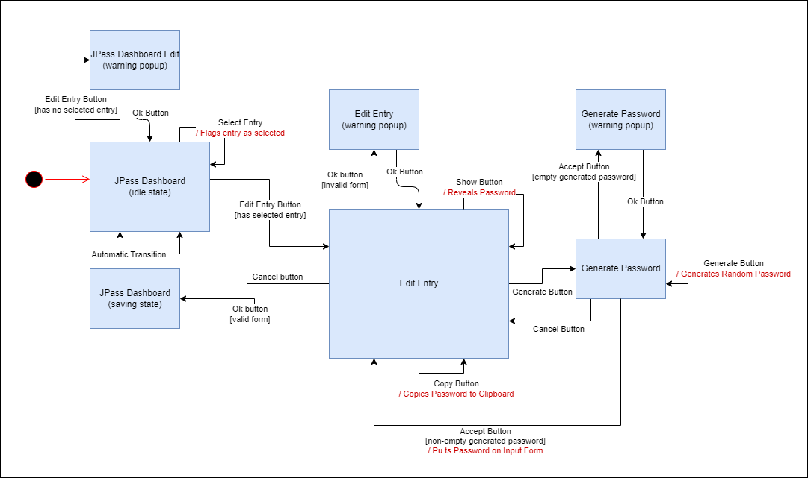
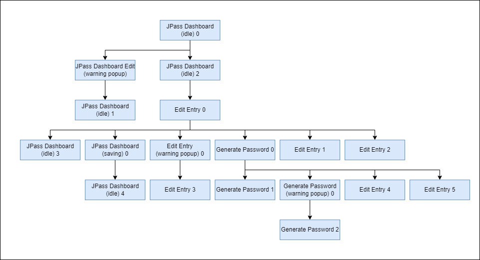

# QF-Test

# Use Case: Edit Entry

> As a user, I want to be able to edit an existing entry on the dashboard, so that I can update its information.

As explicit on the user story, the use case consists on editing a previously created entry. That can be achieved by: first selecting the entry on the dashboard, then clicking on the button `Edit entry...`, or as alternative double-clicking the entry, and then editing the fields and clicking the `Ok` button to save the changes made.

The choice of this use case is due to it being part of the main functionalities of JPass application, along with the creation of entries, as it allows the user to make changes to the entries without having to create them from zero.

## State Machine

The state machine for this use case consists of the following:

### States
Consists of 7 states: 3 "normal" states, 2 error states and 1 transitional state.

- **JPass Dashboard (idle state)**: JPass main screen;
- **JPass Dashboard Edit (warning popup)**: Error state. Appears a warning popup when it's attempted to click on `Edit Entry` without an entry selected;
- **JPass Dashboard (saving state)**: Transitional state. Represents an intermediary internal state where the changes are being saved;
- **Edit Entry**: Screen with the form to edit the entry's fields;
- **Edit Entry (warning popup)**: Error state. Appears a warning popup when it's attempted to save changes on an entry with an invalid form. An invalid form can be one of the following:
  - Title field is empty;
  - Password and repeated password fields do not match (note: can be both empty).
- **Generate Password**: Screen for generating a random password;
- **Generate Password (warning poup)**: Error state. Appears a warning popup when it's attempted to `Accept` the generated password while the generated password field is empty;

### Events
Each event present in the diagram corresponds to the name of the button to click while on that state. Some of the events contain conditions or actions, such as:

- **Edit Entry Button [has no selected entry]** - transition occurs when `Edit Entry` button is clicked while not having any entry selected on the dashboard;
- **Edit Entry Button [has selected entry]** - transition occurs when `Edit Entry` button is clicked while having any entry selected on the dashboard;
- **Select Entry / Flags entry as selected** - transition executes an action of making the entry clicked marked as selected by the program;
- **Ok Button [invalid form]** and **Ok Button [valid form]** - transition occurs when the edit entry form is incomplete or invalid, and valid, respectively. An invalid form consists of:
  - Empty title field;
  - Non-matching passwords in password and repeat password field (both can be empty);
- **Show Button / Reveals Password** - transition executes an action of revealing or hiding the password in the form, i.e., password is either show as raw text (revealed) or with asterisks (hidden);
- **Copy Button / Copies Password to Clipboard** - transition executes an action of copying the password on the password field to the system clipboard;
- **Accept Button [empty generated password]** and **Accept Button [non-empty generated password]** - transition occurs when the generated password field is empty, resulting in an error state, or non-empty respectively.

## Transition Tree

## Transition Table

|          **State / Event**         | **Automatic Transition** | **Select Entry / Flags Entry as selected** |      **Ok Button**     | **Ok Button [invalid form]** | **Ok Button [valid form]** | **Show Button / Reveals Password** | **Copy Button / Copies Password to Clipboard** | **Cancel Button** | **Edit Entry Button [has selected entry]** | **Edit Entry [has no selected entry]** | **Accept Button [empty generated password]** | **Accept Button [non-empty generated password]** | **Generate Button / Generates Random Password** |
|:----------------------------------:|--------------------------|:------------------------------------------:|:----------------------:|:----------------------------:|:--------------------------:|:----------------------------------:|:----------------------------------------------:|:-----------------:|:------------------------------------------:|:--------------------------------------:|:--------------------------------------------:|:------------------------------------------------:|:-----------------------------------------------:|
|     **JPass Dashboard (idle)**     |                          |           JPass Dashboard (idle)           |                        |                              |                            |                                    |                                                |                   |                                            |                                        |                                              |                                                  |                                                 |
|    **JPass Dashboard (saving)**    | JPass Dashboard (idle)   |                                            |                        |                              |                            |                                    |                                                |                   |                                            |                                        |                                              |                                                  |                                                 |
| **JPass Dashboard Edit (warning)** |                          |                                            | JPass Dashboard (idle) |                              |                            |                                    |                                                |                   |                                            |                                        |                                              |                                                  |                                                 |
|           **Edit Entry**           |                          |                                            |                        |                              |                            |                                    |                                                |                   |                                            |                                        |                                              |                                                  |                                                 |
|      **Edit Entry (warning)**      |                          |                                            |                        |                              |                            |                                    |                                                |                   |                                            |                                        |                                              |                                                  |                                                 |
|        **Generate Password**       |                          |                                            |                        |                              |                            |                                    |                                                |                   |                                            |                                        |                                              |                                                  |                                                 |
|   **Generate Password (warning)**  |                          |                                            |                        |                              |                            |                                    |                                                |                   |                                            |                                        |                                              |                                                  |                                                 |