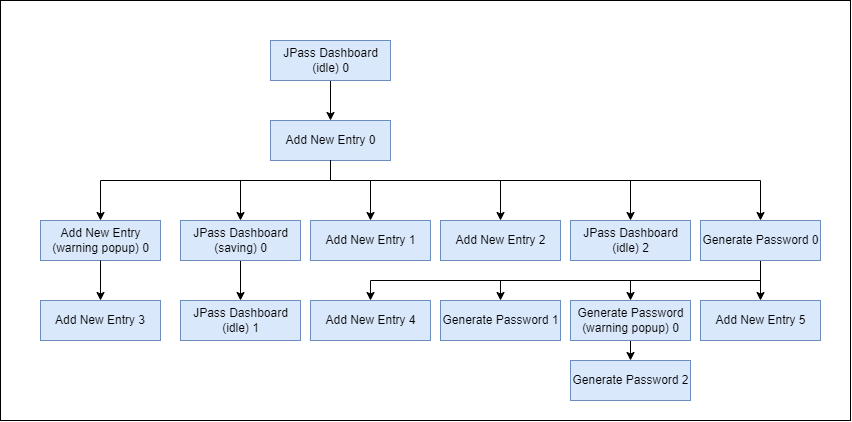

# QF-Test

To run the `.qft` tests in QF-Test tool, please ensure to modify the paths to your specific path.

1. Go to the `.qft` files;
2. Search for `{YOUR_PATH_HERE}`
3. Replace it with your path to `jpass` root directory parent directory.

Example, if JPass is in your desktop, replace `{YOUR_PATH_HERE}` with `C:\Users\your_username\Desktop\`, for Windows case.

Note, those tests were developed on Windows platform and might not run correctly on other OS like Linux or MacOS.

# Use Case: Add New Entry
> As a user, I want to be able to add a new entry to the dashboard, so that I can save a password in JPass.

As referred in the user story, the use case comprises of adding a new entry to the system, which can be achieved by the following sequence of actions: click on the `Add Entry...` button, filling the fields of the form that appears, and afterwards clicking on the `Ok` button. To note that, for an entry to be added successfully (valid entry), at least the field `Title` must be non-empty, and if the one of the password fields is non-empty, the other must have the same contents.

This use case corresponds to one of the core functionalities of JPass, allowing the user to save a password in the application, reason why we chose this use case.

## State Machine

### States

Consists of 6 states, of which 3 are "normal" states, 2 can be considered error states, and 1 transitional.
- **JPass Dashboard (idle state)**: JPass main screen;
- **JPass Dashboard (saving state)**: Transitional state. Represents an intermediary internal state where the changes are being saved;
- **Add New Entry**: Screen with the form to fill in the to-be-created entry
- **Add New Entry (warning popup)**: what we consider an Error state, in which a warning popup appears when it is attempted to create an entry with an invalid form. An invalid form can be one of the following:
  - Title field is empty;
  - Password and repeated password fields do not match (note: can be both empty).
- **Generate Password**: Screen for generating a random password;
- **Generate Password (warning popup)**: Error state. Appears a warning popup when it's attempted to `Accept` the generated password while the generated password field is empty;

### Events

The events that allow state transitions are present in the next diagram, being sometimes associated with conditions (between `[]`) and actions (after `/`):
- **Ok Button [invalid form]** and **Ok Button [valid form]** - transition occurs when the edit entry form is incomplete or invalid, and valid, respectively. An invalid form can be identified by one of two characteristics (or both):
  - Empty title field;
  - Non-matching passwords in password and repeat password field (where both can be empty);
- **Show Button / Reveals Password** - transition executes an action of revealing or hiding the password in the form, i.e., password is either show as raw text (revealed) or with asterisks (hidden);
- **Copy Button / Copies Password to Clipboard** - transition executes an action of copying the password on the password field to the system clipboard;
- **Accept Button [empty generated password]** and **Accept Button [non-empty generated password]** - transition occurs when the generated password field is empty, resulting in an error state, or non-empty respectively.
- **Generates Button** - transition happens when the `Generate` button in the "Generate Password" Window is pressed, resulting in the generation of a random password (based on the criteria selected) that replaces the contents of the text box above the button.

State Diagram:

## Transition Tree

## Transition table
| **States\Events**                     | **Add New Entry Button** | **Cancel Button**      | **Ok Button [valid form]** | **Ok Button [invalid form]**   | **Automatic Transition** | **Ok Button**     | **Copy Button** | **Show Button** | **Generate Button** | **Accept Button [non-empty generated password]** | **Accept Button [empty generated password]** |
|---------------------------------------|--------------------------|------------------------|----------------------------|--------------------------------|--------------------------|-------------------|-----------------|-----------------|---------------------|--------------------------------------------------|---------------------------------------------|
| **JPass Dashboard (idle)**            | Add New Entry            |                        |                            |                                |                          |                   |                 |                 |                     |                                                  |                                             |
| **JPass Dashboard (saving)**          |                          |                        |                            |                                | JPass Dashboard (idle)   |                   |                 |                 |                     |                                                  |                                             |
| **Add New Entry**                     |                          | JPass Dashboard (idle) | JPass Dashboard (saving)   | Add New Entry (warning popup)  |                          |                   | Add New Entry   | Add New Entry   | Generate Password   |                                                  |                                             |
| **Add New Entry (warning popup)**     |                          |                        |                            |                                |                          | Add New Entry     |                 |                 |                     |                                                  |                                             |
| **Generate Password**                 |                          | Add New Entry          |                            |                                |                          |                   |                 |                 | Generate Password   | Add New Entry                                    |                                             |
| **Generate Password (warning popup)** |                          |                        |                            |                                |                          | Generate Password |                 |                 |                     |                                                  | Generate Password (warning popup)           |

The left column and the first row represent, respectively, the starting states and the possible Events that allow transition of states. Each cell value represents the resulting state after applying the 

## Tests Implemented

From the Transition Tree Diagram, is it possible to identify 9 paths, each from the root to every leaf.
From top to bottom and from the left to the right:

- **Copy Password** - Testing the `Copy`password button (to the clipboard) in the `Add New Entry` window. From the main screen, the test starts by opening the New Entry Form (by pressing the `Add Entry...` button), fills some of the fields (in the implemented test the exact values were `test` for the `Title` and `12345` for both the `Password` and `Repeat` fields), then clicks on the `Copy` button in order to copy the password value to the clipboard and then pastes it in the `Notes` text box, checking if that value is indeed `12345`. The test ends with a cleanup that cancels the entry that was being created and takes JPass back to the initial dashboard (via the existing `Cancel` buttons).

- **Show Password** - Attempts to test the visibility toggle of the `Password` field, being similar to the previous one. The state sequence, was identical, difering only the event that leads to the last transition. Instead of clicking on the `Copy` button, the `Show` button of the `Add New Entry` form is the target, being the button checked before and after the click.

- **Cancel New Entry Creation** - From the main screen (no existent entries), `Add New Entry` opens the New Entry (dialog) Form, and the `Cancel` button goes back to the JPass Dashboard, where then it is checked that there are no entries.

- **Create Warning** - From the main screen, `Add New Entry` opens the New Entry Form, and a click on the `Ok` button brings up the Warning dialog Window, hinting at the fact that the provided information (in the specific case of the test, none of the fields have any contents) results in an invalid form.

- **Create entry** - From the main screen, `Add New Entry` opens the New Entry Form. After populating fields in order to have a valid form (details on what makes a form valid or note were mentioned previously; in this test, `Youtube` is the `Title`, `youtube.com` the `URL`, `Zote` is the `Username`, the password is `princecharming` and the `My main Youtube account` is text in the `Notes` field). After clicking on the `Ok` button, in the JPass Dashboard should be possible to see an entry entitled `Youtube`.

- **Generate Password** - From the main screen, `Add New Entry` opens the New Entry Form. The `Generate` button is clicked which should lead to a new window (`Generate Password`), where, by pressing the button `Generate`, a random generated password should appear in the text box above. The `Accept` button is pressed and the field `Password`(and `Repeat`) are filled with that string, being its length verified (equality check for 14 characters as can be seen in one of the settings of that `Generate Password` window).

- **Generate Generate** - From the main screen, `Add New Entry` opens the New Entry Form, and the `Generate` button should open the `Generate Password` dialog window. As the previous test case, the length (14) of the generated password is checked, and afterwards the contents of the box containing that string are deleted, and the `Generate` button is once again clicked as well as the check for the newly created string length.

- **Generate Warning** - From the main screen, `Add New Entry` opens the New Entry Form (as before, no fields are filled here), and the `Generate` button should open the `Generate Password` dialog window. A click on the `Accept` button should result in the appearance of a `Warning` window informing that the generated password field is empty.

- **Generate Cancel** - From the main screen, `Add New Entry` opens the New Entry Form (as before, no fields are filled here), and the `Generate` button should open the `Generate Password` dialog window. The `Cancel` button is clicked and a check is performed in which is detected that the `Password`(/`Repeat`) field is still empty.

- **(Sneak Path) Force Save Empty entry** - From the `Generate Password` window (reachable from the JPass Dashbord -> `Add Entry...` button -> `Generate` button), attempt to click on the `Ok` button in the `Add New Entry` dialog window, and therefore, save a totally empty entry.
 
All 10 tests executed and finished without errors or expections, as expected, being the sneak path test the only one where the intended behavior was the raise of an exception (`ModalDialogException`), due to being unable to click on the wanted button, which was handled via a try and catch block followed by a `wait for absence` of the `dialogWarning` window component with a 3000ms timeout.

To note that in cases of copying and pasting in the tests, the keys recorded in the QF-test Tool for that effect were `control` + `c` and `control` + `v`. Therefore, and also due to not being able to simulate such alternative keypresses, there might be errors when trying to run those tests in operating systems other than Windows (e.g., MacOS, where the `Command` key has the functions of `Control` in Windows).

# Use Case: Edit Entry

> As a user, I want to be able to edit an existing entry on the dashboard, so that I can update its information.

As explicit on the user story, the use case consists on editing a previously created entry. That can be achieved by: first selecting the entry on the dashboard, then clicking on the button `Edit entry...`, or as alternative double-clicking the entry, and then editing the fields and clicking the `Ok` button to save the changes made.

The choice of this use case is due to it being part of the main functionalities of JPass application, along with the creation of entries, as it allows the user to make changes to the entries without having to create them from zero.

## State Machine

The state machine for this use case consists of the following:

### States
Consists of 7 states: 3 "normal" states, 2 error states and 1 transitional state.

- **JPass Dashboard (idle state)**: JPass main screen;
- **JPass Dashboard Edit (warning popup)**: Error state. Appears a warning popup when it's attempted to click on `Edit Entry` without an entry selected;
- **JPass Dashboard (saving state)**: Transitional state. Represents an intermediary internal state where the changes are being saved;
- **Edit Entry**: Screen with the form to edit the entry's fields;
- **Edit Entry (warning popup)**: Error state. Appears a warning popup when it's attempted to save changes on an entry with an invalid form. An invalid form can be one of the following:
  - Title field is empty;
  - Password and repeated password fields do not match (note: can be both empty).
- **Generate Password**: Screen for generating a random password;
- **Generate Password (warning popup)**: Error state. Appears a warning popup when it's attempted to `Accept` the generated password while the generated password field is empty;

### Events
Each event present in the diagram corresponds to the name of the button to click while on that state. Some of the events contain conditions or actions, such as:

- **Edit Entry Button [has no selected entry]** - transition occurs when `Edit Entry` button is clicked while not having any entry selected on the dashboard;
- **Edit Entry Button [has selected entry]** - transition occurs when `Edit Entry` button is clicked while having any entry selected on the dashboard;
- **Select Entry / Flags entry as selected** - transition executes an action of making the entry clicked marked as selected by the program;
- **Ok Button [invalid form]** and **Ok Button [valid form]** - transition occurs when the edit entry form is incomplete or invalid, and valid, respectively. An invalid form consists of:
  - Empty title field;
  - Non-matching passwords in password and repeat password field (both can be empty);
- **Show Button / Reveals Password** - transition executes an action of revealing or hiding the password in the form, i.e., password is either show as raw text (revealed) or with asterisks (hidden);
- **Copy Button / Copies Password to Clipboard** - transition executes an action of copying the password on the password field to the system clipboard;
- **Accept Button [empty generated password]** and **Accept Button [non-empty generated password]** - transition occurs when the generated password field is empty, resulting in an error state, or non-empty respectively.

## Transition Tree
It can be seen paths leading from a parent state to a child state which is the "same" as the parent state, or a parent state leading to two children states that are the "same". This is due to the conditons on the transitions above. For example, from the path of `JPass Dashboard (idle) 0` to `JPass Dashboard (idle) 2` must happen because it is needed for an entry to be selected in order to proceed to the `Edit Entry` state. Additionally, the state `Edit Entry 0` leads to two "copies" of its own state, `Edit Entry 1` and `Edit Entry 2`, this is to represent the `Show` button and `Copy` button, which lead to the same state but have different actions. Similar situation can be seen on other states with this behaviour.

## Transition Table

|          **State / Event**         | **Automatic Transition** | **Select Entry / Flags Entry as selected** |      **Ok Button**     | **Ok Button [invalid form]** | **Ok Button [valid form]** | **Show Button / Reveals Password** | **Copy Button / Copies Password to Clipboard** |    **Cancel Button**   | **Edit Entry Button [has selected entry]** | **Edit Entry [has no selected entry]** | **Accept Button [empty generated password]** | **Accept Button [non-empty generated password]** | **Generate Button / Generates Random Password** |
|:----------------------------------:|--------------------------|:------------------------------------------:|:----------------------:|:----------------------------:|:--------------------------:|:----------------------------------:|:----------------------------------------------:|:----------------------:|:------------------------------------------:|:--------------------------------------:|:--------------------------------------------:|:------------------------------------------------:|:-----------------------------------------------:|
|     **JPass Dashboard (idle)**     |                          |           JPass Dashboard (idle)           |                        |                              |                            |                                    |                                                |                        |                 Edit Entry                 |        JPass Dashboard (warning)       |                                              |                                                  |                                                 |
|    **JPass Dashboard (saving)**    | JPass Dashboard (idle)   |                                            |                        |                              |                            |                                    |                                                |                        |                                            |                                        |                                              |                                                  |                                                 |
| **JPass Dashboard Edit (warning)** |                          |                                            | JPass Dashboard (idle) |                              |                            |                                    |                                                |                        |                                            |                                        |                                              |                                                  |                                                 |
|           **Edit Entry**           |                          |                                            |                        |     Edit Entry (warning)     |  JPass Dashboard (saving)  |             Edit Entry             |                   Edit Entry                   | JPass Dashboard (idle) |                                            |                                        |                                              |                                                  |                                                 |
|      **Edit Entry (warning)**      |                          |                                            |       Edit Entry       |                              |                            |                                    |                                                |                        |                                            |                                        |                                              |                                                  |                                                 |
|        **Generate Password**       |                          |                                            |                        |                              |                            |                                    |                                                |       Edit Entry       |                                            |                                        |          Generate Password (warning)         |                    Edit Entry                    |                Generate Password                |
|   **Generate Password (warning)**  |                          |                                            |    Generate Password   |                              |                            |                                    |                                                |                        |                                            |                                        |                                              |                                                  |                                                 |

As can be seen on the transition tree above, it will be developed 10 test cases, and an additional sneak-path of the 75 total sneak paths possible, which can be seen on the transition table above.

Note that some of the tests, such as the one that leads to the `Copy` button, the `Generate` button and its subtrees, and `Show` button are the exact same as the ones developed in the `Add Entry` use case, and therefore will be omitted in this use case. This leads to 4 tests plus the additional sneak path test.

- **Edit Entry No Selected** - From the main screen, and having no entry selected (or no entries at all in the database), click on `Edit Entry` button, and it should trigger a warning popup regarding not having an entry selected. To verify if the test executed as expected, it is verified if the warning popup is open.
  - The test developed executes as expected.
- **Edit Entry Cancel** - From the main screen, select an entry and click on the `Edit Entry` button to open the edit entry form. Afterwards, change a field (i.e. title, password, etc.) and click on the `Cancel` button to cancel operation and return to main screen. To verify if test executed as expected, it is verified if the changed field wasn't changed.
  - The test developed executes as expected.
- **Edit Entry Normal** - From the main screen, select an entry and click on the `Edit Entry` button to open the edit entry form. Afterwards, change a field (i.e. title, password, etc.) and click on the `Ok` button to save the changes made and return to main screen. To verify if test executed as expected, it is verified if the changed field was changed to the expected.
  - The test developed executes as expected.
- **Edit Entry Warning** - From the main screen, select an entry and click on the `Edit Entry` button to open the edit entry form. Afterwards, change the title field to empty or the password to a non-matching password with the repeated password field, and finally click on the `Ok` button which should trigger the warning due to invalid form.  To verify if the test executed as expected, it is verified if the warning popup is open.
  - The test developed executes as expected.
- **(Sneak Path) Force Generate Password** - From the main screen, it is attempted to force an event of clicking on the `Generate` button in the edit entry form to open the dialog for generating passwords. In order to verify the test, it was built as expecting an exception due to missing component and then verified if the generate password dialog isn't open. 
  - The test developed executes as expected, this is, the event doesn't result in anything, meaning the program behaves as expected.

# Use Case: Change Password

> As a user, I want to be able to edit the master password of the entries database file, so that I can save and keep my passwords safe.

Being also part of the core functionalities, the choice for this use case was due to testing the functionality of being able to change the master password that locks the saved file so that it can be loaded and unlocked later by the user.

## State Machine

Consists of 7 states: 3 "normal" states, 2 error states and 1 transitional state.

- **JPass Dashboard (idle state)**: JPass main screen, including its dropdown menus;
- **Enter Password**: Screen to change master password of the database;
- **Enter Password (warning popup)**: Error state. Occurs when it's attempted to change password to an empty one or when password and repeated password don't match;
- **Enter Password (information popup)**: Popup screen indicating the changes were saved;

### Events
Each event present in the diagram corresponds to the name of the button to click while on that state. Some of the events contain conditions or actions, such as:

- **File Button / Open File dropdown menu** - transition occurs when `File` button is clicked, executing an action of opening a dropdown menu on the main screen;
- **Change Password Button [File dropdown menu open]** - transition occurs if it's clicked on change password button while the file dropdown menu is open, i.e. the file button has been clicked previously and not clicked anywhere else or in the file button again;
- **Ok Button [invalid form]** and **Ok Button [valid form]** - transition occurs when the change password form is incomplete or invalid, and valid, respectively. An invalid form consists of:
  - Empty password;
  - Non-matching passwords in password and repeat password field;

## Transition Tree
It can be seen paths leading from a parent state to a child state which is the "same" as the parent state, or a parent state leading to two children states that are the "same". This is due to the conditons on the transitions above. For example, from the path of `JPass Dashboard (idle) 0` to `JPass Dashboard (idle) 1` must happen because it is needed to open the dropdown menu to fulfill the condition. Additionally, the state `Enter Password` leads to two "copies" of the state `Enter Password (information)`, but one reprents an information after cancelling the operation (via cancel button), and the other represents a successful change of password.

## Transition Table

|         **State / Event**        |     **File Button**    | **Change Password Button** |      **Ok Button**     | **Ok Button [invalid form]** |  **Ok Button [valid form]**  |       **Cancel Button**      |
|:--------------------------------:|:----------------------:|:--------------------------:|:----------------------:|:----------------------------:|:----------------------------:|:----------------------------:|
|    **JPass Dashboard (idle)**    | JPass Dashboard (idle) |       Enter Password       |                        |                              |                              |                              |
|        **Enter Password**        |                        |                            |                        |   Enter Password (warning)   | Enter Password (information) | Enter Password (information) |
|   **Enter Password (warning)**   |                        |                            |     Enter Password     |                              |                              |                              |
| **Enter Password (information)** |                        |                            | JPass Dashboard (idle) |                              |                              |                              |

As can be seen on the transition tree above, it will be developed 3 test cases, and an additional sneak-path of the 17 total sneak paths possible, which can be seen on the transition table above.

- **Change Password Warning** - From the main screen, it is clicked on the `File` button to open the dropdown menu, and then the `Change Password...` button on the dropdown menu. It should open a dialog for changing the password, in which, to trigger a warning you can input different passwords on the password and repeat password fields or leave it empty. Any of those cases should trigger the warning popup. To verify the test works, it is verified if the warning popup is open.
  - The test developed executes as expected.
- **Change Password Cancel** - From the main screen, it is clicked on the `File` button to open the dropdown menu, and then the `Change Password...` button on the dropdown menu. It should open a dialog for changing the password, in which, click on the `Cancel` button and it should lead to a information popup saying that there were no changes to the password. To verify the test works, it is verified if the information popup is open and contains the expected description.
  - The test developed executes as expected.
- **Change Password Normal** - From the main screen, it is clicked on the `File` button to open the dropdown menu, and then the `Change Password...` button on the dropdown menu. It should open a dialog for changing the password, in which, you should input a password on both fields, matching, and then click on the `Ok` button, which should lead to a information popup saying the password has been changed and saved. To verify the test works, it is verified if the information popup is open and contains the expected description.
  - The test developed executes as expected.
- **(Sneak Path) Force Save Password** - From the main screen, attempt to force an event of clicking on the `Ok` button in the change password dialog to force either a successful save or a warning. To verify if the test is working, it is expected for the test to throw an exception, and then it is also verified if the information/warning popup isn't open.
  - The test developed executes as expected, this is, the event doesn't result in anything, meaning the program behaves as expected.

# Feedback on QF-Test
While the tool seems interesting for developing UI testing, it also comes with some difficulties for developers, such as:
- Outdated interface, which leads to confusing methodologies on implementation of methods, for example, lack of checking options and inability to navigate when in checking mode (i.e. opening dropdown menus).
- While there's ***best practices*** for organisation of test-suites, it provides little to no version control, making the development in pairs or in team not friendly, and also requires manual management of paths.
- Poor documentation/tutorial on how dependencies works, their order of execution and how to setup multi-step dependency trees, each with their own `Setup` and `Cleanup` processes.